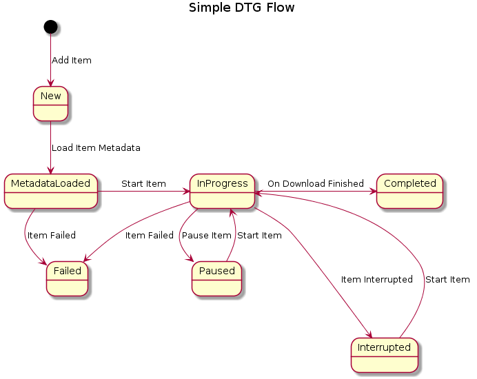
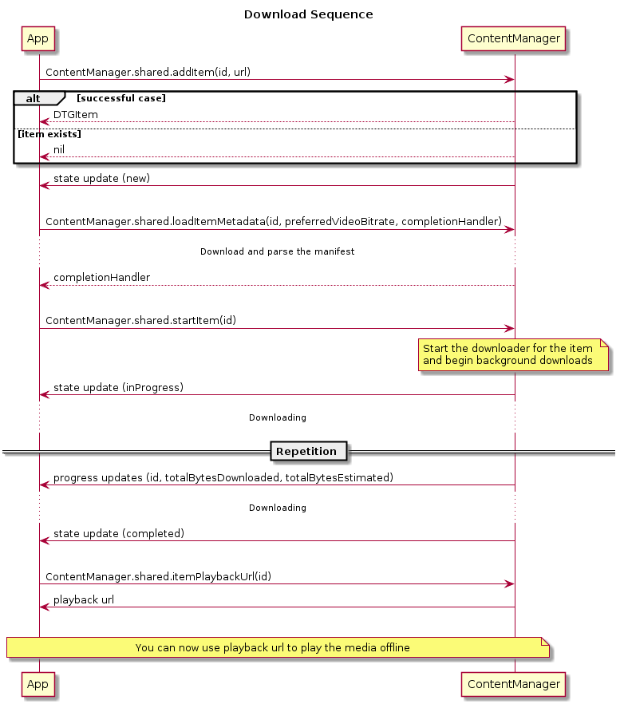

# Download-to-Go for iOS
{:.no_toc}

Download to Go (DTG) is an iOS library that facilitates the download of HLS video assets.

* TOC
{:toc}

## Supported Features 
- Downloading Kaltura HLS assets (Clear only)
- Background downloading.
- Resuming interrupted/paused downloads.

## Known Limitations
- No track selection (downloads all tracks)
- Can't play downloaded assets in background

## Installation

### [CocoaPods][cocoapods]

Add this to your podfile:
```ruby
pod 'DownloadToGo'
```

## Overview

### Simple Flow



>Note: 
* Failed is a temp state, the delegate will notify and item has failed and content manager will remove this item. In addition, keep in mind that when receiving failed state an error will also be provided in the delegate to indicate the reason.
* There is also `Removed` state which is not displayed here. `Removed` is a temporary state indicated an item was removed (can be considered as an event). You can remove an item from all states. 

### Download Sequence



### Simple Playing Sequence (Using PlayKit Player)


## Usage

To use the DTG make sure to import in each source file:
```swift
import DownloadToGo
```

The following classes/interfaces are the public API of the library:
* `ContentManager` - Use this class to interact with the library.
* `DTGContentManager` - This is the main api you will use to interact with the library.
* `ContentManagerDelegate` - Delegate calls available to observe.
* `DTGItem` - Represent a single download item.
* `DTGItemState` - The state of a download item.

Basic Implementation:
```swift
class DownloadManager: ContentManagerDelegate {

    let cm: DTGContentManager

    init() {
        // setup content manager and delegate
        cm = ContentManager.shared
        cm.delegate = self
    }

    func downloadItem(id: String, url: URL) {
        _ = cm.addItem(id: id, url: url) // make sure the item was added
        do {
            try cm.loadItemMetadata(id: self.selectedItem.id, preferredVideoBitrate: 300000)    {
                // metadata loaded
                try cm.startItem(id: self.selectedItem.id)
            }
        } catch {
            // handle errors
        }
    }

    func playbackUrl(id: String) -> URL? {
        do {
            return try downloadManager.itemPlaybackUrl(id: id)
        } catch {
            // handle errors
            return nil
        }
    }

    func item(id: String, didDownloadData totalBytesDownloaded: Int64, totalBytesEstimated: Int64?) {
        // handle progress updates
    }

    func item(id: String, didChangeToState newState: DTGItemState, error: Error?) {
        // handle state changes (metadataLoaded, inProgress, completed etc...)
    }
}
```

Basic Implementation with PlayKit:
```swift
class VideoViewController: UIViewController {

    let downloadManager = DownloadManager()
    var player: Player?
    @IBOutlet weak var playerView: PlayerView!

    override func viewDidLoad() {
        super.viewDidLoad()
        do {
            let player = try PlayKitManager.shared.loadPlayer(pluginConfig: nil)
            self.player = player
            player.view = self.playerView

            ContentManager.shared.start() {
                if let localUrl = downloadManager.playbackUrl(id: "myLocalId") {
                    let mediaEntry = localAssetsManager.createLocalMediaEntry(for: "myLocalId", localURL: localUrl)
                    player.prepare(MediaConfig(mediaEntry: mediaEntry))
                    // you can now call prepare when you want (in case no error)
                }
            }            
        } catch {
            // handle errors
        }
    }
}
```

>Note: Make sure to call `ContentManager.shared.stop()` when finished with playback.

[cocoapods]: https://cocoapods.org/
